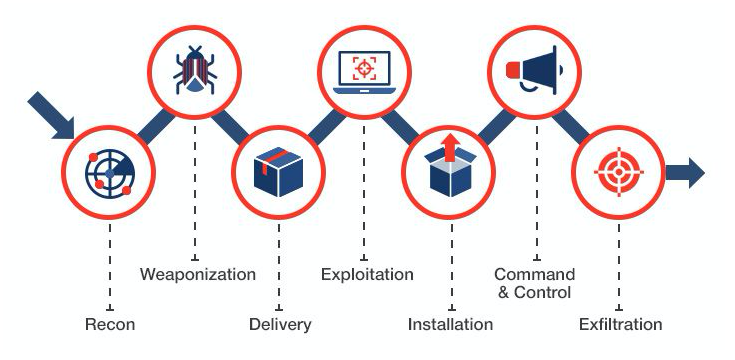

# Azure Virtual Desktop Deployment

In this project, I implemented a comprehensive Azure Virtual Desktop (AVD) solution in Microsoft Azure, recreating an enterprise-grade virtual desktop environment designed to deliver secure remote access, centralized administration, and on-demand scalability. I built the entire infrastructure from scratch, applying architecture guidelines and best practices recommended for corporate cloud environments.
Tools and Services Used:

## About Security

Data leakage caused by users and data integrity remain among the most critical challenges today. For this reason, this type of technology captured my attention, and I decided to implement it to analyze its design from a reverse engineering perspective and understand why it represents a highly secure platform. This lab allowed me to closely observe its architecture and the protection layers that safeguard the environment within the tenant.

## Azure Resource group (RG)
This Resource Group enables centralized management, monitoring, and control of the entire lab infrastructure from a single point, following Azure administration best practices.

## avd-0 (Virtual Machine):
Virtual machine configured as a Session Host, responsible for delivering remote desktop sessions to end users.

## avd-0-nic (Network Interface):
Network interface that connects the virtual machine to the virtual network environment, enabling internal communication and controlled access.

## avd-0_OsDisk (Disk):
Operating system disk of the virtual machine, where the base Session Host environment is stored.

## MyHostPool1 (Host Pool):
Logical group that manages and distributes user sessions across available Session Hosts.

## MyHostPool1-DAG (Application Group):
Application group that defines which remote desktops or applications are made available to users.

## MyWorkSpace1 (Workspace):
Access point where users view and launch their assigned desktops or remote applications.

## vnet-prueba1 (Virtual Network):
Virtual network that provides secure connectivity between all AVD environment resources.

# Permission assignment

After creating the architecture, I assigned the necessary permissions to allow access to the virtual desktop. First, I granted users the Azure Virtual Machine User Login role, which allows them to sign in to the virtual machine.

Then, I assigned the users to the Azure Virtual Desktop Application Group, which is linked to the host pool. Finally, I verified that this Application Group was associated with the Workspace, since this is the access point to the virtual desktop through the web portal.

## Microsoft Entra ID 

As part of the permissions and access configuration, I also set up single sign-on with Microsoft Entra ID within the host pool. To do this, I enabled the option that allows connections to use Microsoft Entra authentication, making access easier by avoiding the need to re-enter credentials.

## Connectivity Testing and Functional Access to the Virtual Environment

Finally, I validated access by signing in to the Azure Virtual Desktop web client through the browser. After logging in with the assigned user credentials, the virtual desktop loaded correctly, confirming that the permission configuration and Microsoft Entra ID sign-in work as expected.

With this, the web-based virtual desktop environment is fully operational and accessible to end users, giving us confidence that all usage remains within a controlled and centrally managed environment.

## Further Learning
If you’re interested in this topic and want to dive deeper, I’m sharing the official Microsoft guide that helped me build this implementation: 

https://learn.microsoft.com/en-us/training/paths/plan-azure-virtual-desktop-implementation/

I hope you find it useful too!
